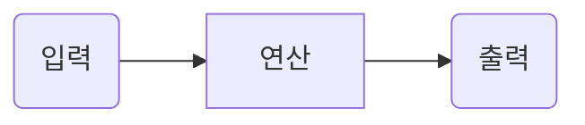

# 개체 모델링

## 클래스 다이어그램
|Human|Description|
|---|---|
|Member Variables|||
|-name: String|private String name|
|-age: int|private int name|
|Member Method|||
|+Human(String, int)|public Human(String xxx, int xxx)|
|+getName(): String|public void String getName()|
|+setName(String)|public void setName(String xxx)|
|+punch(Human)|public void punch(Human xxx)|
|+pat(Dog)|public void pat(Dog dog)|

